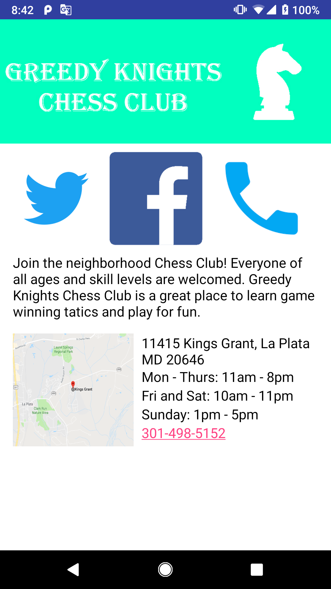

# GreedyKnightsChessClub

<b> A single screen app that displays information about a fictional neighborhood chess club. </b>

Project #1 for the <b> Android Basics Nanodegree by Google </b> 

This app transformed a hand-drawn app design into layouts using XML as well as Views and ViewGroups to display images and text. 

When the images are clicked, an intent is used to take the user to the club's facebook and twitter page. The phone image uses intent to take the user to their 
phone app to directly dial the club's number. The map image uses intent to take the user to their GPS app and direct them to the
club's location.

Core Concepts I learned Completing this Project:
----------------------------------------------
- Intents
- Implementing OnClickListeners

